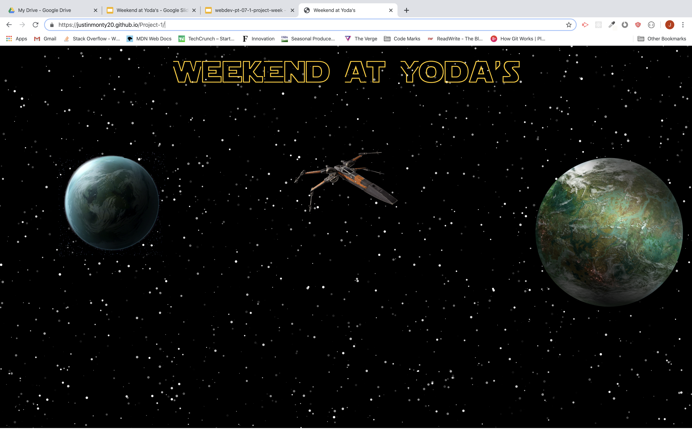

# Project-1
Yoda speech translator

https://justinmonty20.github.io/Project-1/

Using a random quote api to generate insperational quotes.
Taking the string and placing it in a yoda speech for translation.
Then placing the translation in a computer speech api to have the computer read it out.

Travel to the planet Dagboh where you will find Baby Yoda,
click the listen to Yoda button to recieve his words of Wisdom.

